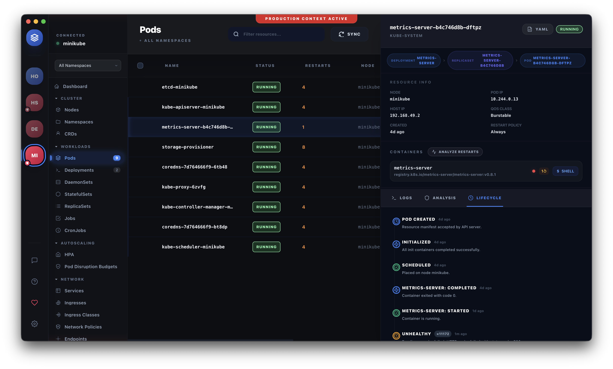
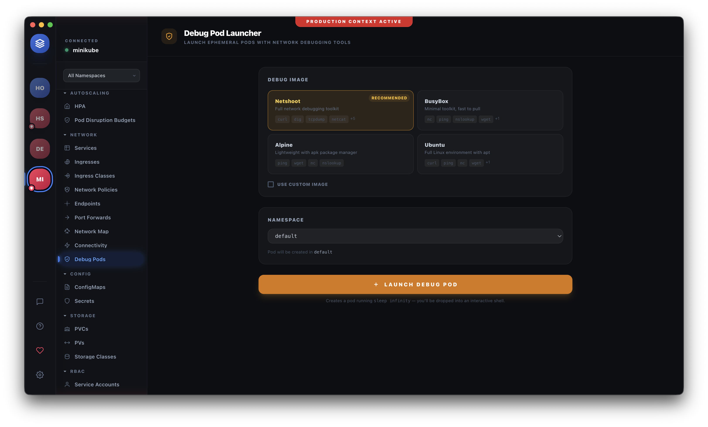
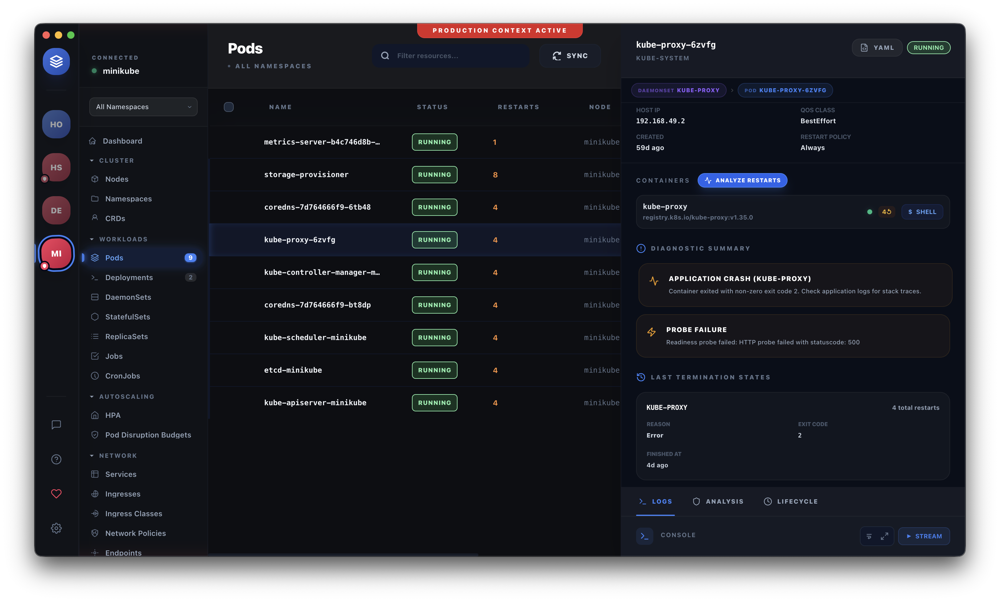
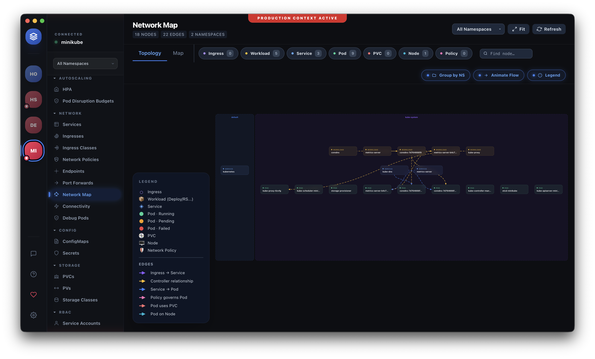
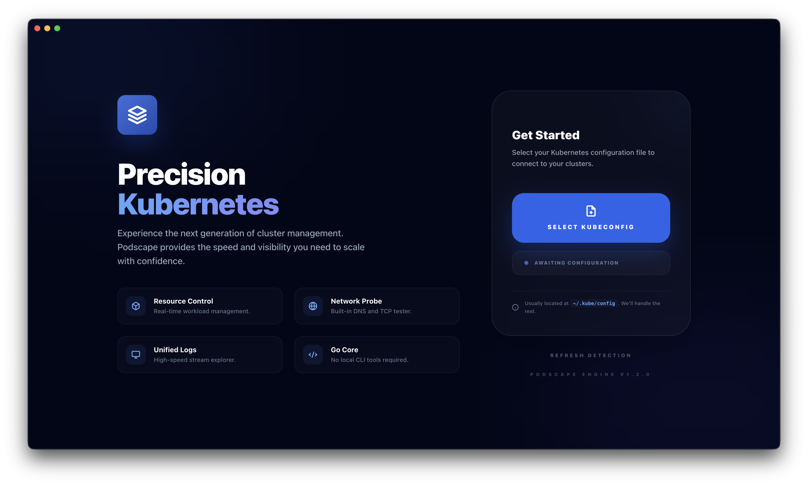
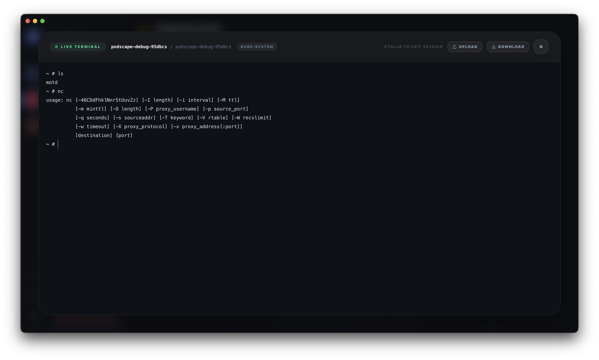
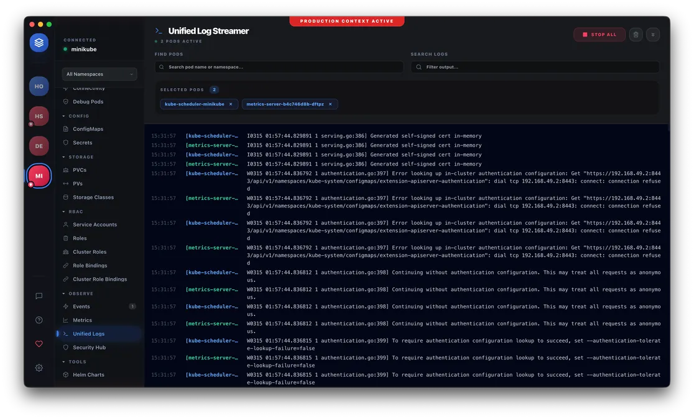

# Podscape 🚀

### The Simplest Way to Work with Kubernetes

**[Download](https://github.com/codingprotocols/podscape/releases/latest)** · **[Docs](https://codingprotocols.github.io/podscape/)** · **[Issues](https://github.com/codingprotocols/podscape/issues)**

---



---

## The Problem

Kubernetes workflows are fragmented:

- Logs → `kubectl` / external tools
- Metrics → Prometheus / Grafana
- YAML → `kubectl apply`
- Debugging → manual chaos

This slows you down when it matters most.

---

## The Solution

Podscape brings everything into one place:

- 🔍 **Real-time cluster state** — via Kubernetes informers, not polling
- 📜 **Logs, events, and resources** in one UI
- ⚙️ **Helm + workload management** — list, inspect, upgrade, rollback
- 🤖 **AI-assisted exploration** — MCP server for Claude, Cursor, and more

Less context switching. Faster debugging.

---

## Why Podscape?

- **No account required** — works with your existing kubeconfig, nothing else
- **Real-time via informers** — not polling; state updates the moment Kubernetes does
- **Everything in one window** — logs, Helm, exec, metrics, security, network map
- **AI-ready** — MCP server lets Claude and Cursor talk directly to your cluster
- **Open source** — Apache 2.0, no telemetry, no subscription

---

## Screenshots

| **Debug Launcher** | **Restart Analyzer** |
| :---: | :---: |
|  |  |
| *One-click ephemeral debug tools* | *Automated CrashLoop diagnosis* |

| **Network Map** | **Onboarding** |
| :---: | :---: |
|  |  |
| *Visual traffic flow intelligence* | *Sleek glassmorphism UX* |

| **Terminal** | **Unified Log Streaming** |
| :---: | :---: |
|  |  |
| *Built-in PTY terminal* | *Real-time multi-pod log streaming* |

---

## Quick Start

**1. Download**

Grab the latest release for your platform:

| Platform | Format |
|----------|--------|
| macOS (Apple Silicon + Intel) | Universal DMG |
| Windows | NSIS installer |
| Linux | AppImage, `.deb` |

👉 **[Download Latest Release](https://github.com/codingprotocols/podscape/releases/latest)**

**macOS note:** The app is signed and notarized. If macOS blocks it on first launch, right-click → Open.

**2. Connect your cluster**

Uses your existing `kubeconfig` — no extra setup required.

**3. Start exploring**

---

## Features

- **Command Palette (⌘K)** — instant access to any section or resource via fuzzy search; jump between clusters and namespaces from the keyboard
- **Multi-cluster support** — switch contexts and namespaces instantly; RBAC-aware startup skips resources the current user cannot access
- **Full resource coverage** — pods, deployments, statefulsets, daemonsets, jobs, cronjobs, HPAs, PDBs, services, ingresses, network policies, configmaps, secrets, RBAC, storage, and more
- **Log streaming** — real-time log tailing with multi-container support and search
- **Exec into containers** — full PTY terminal sessions directly in the app
- **Port forwarding** — one-click port-forward with live status, auto port detection, and clickable local URLs
- **Helm management** — list releases, inspect values, view history, rollback, and direct upgrades with automated update detection
- **Connectivity Tester** — source-to-target network diagnostics (DNS, TCP, HTTP) with automated NetworkPolicy and endpoint failure analysis
- **Production Context Protection** — visual banners and frame indicators when connected to sensitive clusters
- **CRD Browser** — explorer and editor for any Custom Resource Definition installed in the cluster
- **Network topology** — force-directed graph of pod-to-service relationships
- **Security scan** — per-pod security posture analysis (privileged containers, missing resource limits, host namespace access)
- **TLS dashboard** — cluster-wide certificate inventory with expiry tracking
- **GitOps panel** — Argo CD / Flux resource overview
- **Kubectl Plugins** — install and run curated Krew plugins (neat, stern, tree, images, whoami, df-pv, outdated) without leaving the app
- **Service mesh support** — Istio, Traefik v2/v3, NGINX Inc, NGINX Community — auto-detected per cluster
- **Events & metrics** — filterable event list and pod/node metrics (requires metrics-server)
- **Built-in terminal** — tabbed PTY terminal with kubectl pre-configured
- **MCP server** — expose your cluster as tools for AI assistants via `podscape-mcp`
- **Auto-updater** — background update downloads and one-click installation for macOS and Windows

---

## Who is this for?

- DevOps Engineers
- Platform Engineers
- Kubernetes users tired of tool fragmentation

---

## Status

Podscape is in early stage. We are actively:

- Improving debugging workflows
- Simplifying UX
- Exploring AI integrations

👉 Expect bugs. Expect rapid changes. We're building in public.

---

## MCP Server

`podscape-mcp` is a standalone binary that exposes your Kubernetes cluster as tools for AI assistants (Claude, Cursor, Copilot, etc.). It ships as a pre-built binary for macOS, Windows, and Linux alongside the app on every GitHub Release.

```bash
# Register with Claude Code (using a pre-built binary)
claude mcp add --transport stdio podscape -- /path/to/podscape-mcp-darwin-arm64

# Or build from source
cd go-core && go build ./cmd/podscape-mcp/
claude mcp add --transport stdio podscape -- ./go-core/podscape-mcp
```

See [go-core/cmd/podscape-mcp/README.md](go-core/cmd/podscape-mcp/README.md) for full setup and tool reference.

---

## Building from Source

**Prerequisites:** Node.js 20+, Go 1.22+

```bash
# Clone and install dependencies
git clone https://github.com/codingprotocols/podscape.git
cd podscape-electron
npm install

# Build the Go sidecar (required before first run)
cd go-core && go build ./cmd/podscape-core/ && cd ..

# Start in dev mode (hot reload)
npm run dev
```

```bash
npm run build          # Build all processes
npm run test           # Run frontend tests (vitest)
cd go-core && go test ./...          # Run Go tests
cd go-core && go build ./cmd/podscape-mcp/   # Build the MCP server binary
```

---

## Architecture

Podscape is a three-process Electron app with a Go sidecar:

```
Renderer (React/TS)
  ├─ HTTP → Go Sidecar (127.0.0.1:5050)   — all k8s + Helm operations
  └─ IPC  → Main Process (Node.js)         — terminal, file dialogs, port-forward, log streaming
```

| Layer | Stack |
|-------|-------|
| Renderer | React 18, TypeScript, Tailwind CSS, Zustand, xterm.js, Monaco Editor |
| Main process | Electron, node-pty |
| Go sidecar | `podscape-core` — HTTP server, shared informer cache, RBAC probe |
| MCP server | `podscape-mcp` — standalone MCP server |

---

## Project Structure

```
podscape-electron/
├── src/
│   ├── main/          # Electron main process (sidecar, IPC handlers, terminal)
│   ├── preload/       # Context bridge — exposes window.kubectl, window.helm, etc.
│   └── renderer/      # React app (components, store, types, hooks, utils, config)
├── docs/              # Feature guides and documentation
├── go-core/
│   ├── cmd/
│   │   ├── podscape-core/   # HTTP sidecar binary
│   │   └── podscape-mcp/    # MCP server binary
│   └── internal/
│       ├── client/          # Shared k8s client initialisation
│       ├── handlers/        # HTTP route handlers
│       ├── informers/       # Shared informer cache
│       ├── k8sutil/         # Canonical GVR mappings and version fallbacks
│       ├── ops/             # Write operations (scale, delete, apply, rollout)
│       ├── exec/            # WebSocket container exec (PTY)
│       ├── logs/            # WebSocket log streaming
│       ├── helm/            # Helm SDK wrapper
│       ├── rbac/            # RBAC probe
│       ├── portforward/     # Port-forward manager
│       ├── prometheus/      # Prometheus auto-discovery and query cache
│       ├── ownerchain/      # Owner reference traversal
│       ├── providers/       # Service mesh / ingress provider detection
│       ├── graph/           # Resource dependency graph engine
│       └── topology/        # Graph post-processing
├── resources/         # Icons, splash screen
└── CHANGELOG.md
```

---

## Feedback

We're looking for early users. Your feedback will directly shape the product.

👉 **[Open an issue](https://github.com/codingprotocols/podscape/issues)** or start a **[discussion](https://github.com/codingprotocols/podscape/discussions)**

---

## Contributing

Contributions are welcome. Please read [CONTRIBUTING.md](CONTRIBUTING.md) before opening a pull request.

---

## License

Apache License 2.0 — see [LICENSE](LICENSE) for details.

&copy; 2026 Coding Protocols Private Limited
