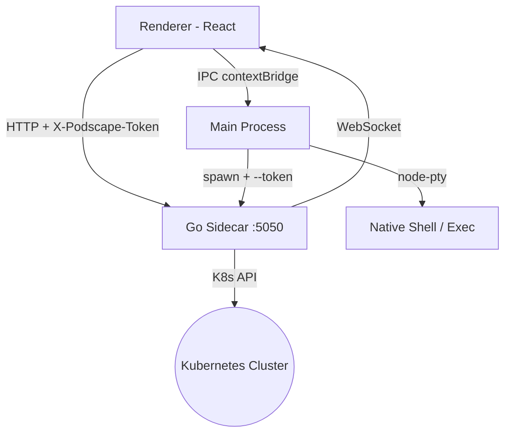

# Architecture Overview

Podscape is a three-process Electron application. Each process has a strictly defined responsibility.

## Process Layout

```
Renderer (React / TypeScript)
  ├── HTTP fetch ──────────────────► Go Sidecar (127.0.0.1:5050)
  │                                   All Kubernetes + Helm operations
  └── IPC via contextBridge ────────► Main Process (Node.js)
                                        Terminal, settings, file dialogs,
                                        log streaming, port-forward, sidecar lifecycle
```

### Renderer (`src/renderer/`)

- Built with **Vite + React + TypeScript + Tailwind CSS**.
- State managed by a single **Zustand** store (`useAppStore`) split into six slices:

| Slice | Responsibility |
|---|---|
| `clusterSlice` | Context/namespace selection, RBAC denied tracking, provider detection trigger |
| `navigationSlice` | Active section, theme, sidebar width, search state |
| `resourceSlice` | All 27+ resource arrays, section loading, dashboard fetch, resource navigation |
| `operationSlice` | Scale/delete/YAML modals, exec session management |
| `analysisSlice` | Security scanning, owner chain, debug pods, Prometheus config |
| `providersSlice` | Istio/Traefik/NGINX provider detection state |

- Talks to the sidecar via plain `fetch()` through IPC helpers (`checkedSidecarFetch` in `src/main/sidecar/api.ts`).

### Go Sidecar (`go-core/`)

The sidecar is a standalone HTTP server compiled as `podscape-core`. It is the source of truth for all Kubernetes and Helm data.

| Package | Responsibility |
|---|---|
| `cmd/podscape-core/main.go` | Route registration, startup, token auth middleware, CORS |
| `internal/handlers/` | HTTP handlers split across 12 files: `resources.go` (resource listers), `operations.go` (scale/delete/rollout), `helm.go`, `security.go`, `network.go`, `tls.go`, `gitops.go`, `prometheus.go`, `ownerchain.go`, `customresource.go`, `providers.go`; `handlers.go` holds the `MakeHandler` RBAC factory and shared helpers |
| `internal/client/` | Shared Kubernetes client initialisation (`ClientBundle`: REST config, clientset, apiextensions client) |
| `internal/informers/` | K8s shared informers — cache resource lists in-memory for fast reads; skips informers for denied resources |
| `internal/store/` | `ClusterStore` singleton: per-context `ContextCache` pool, active context pointer |
| `internal/rbac/` | `CheckAccess` — concurrent `SelfSubjectAccessReview` probe (list + watch, 8-goroutine pool); `AllResources` descriptor table |
| `internal/ops/` | Write operations shared between sidecar and MCP server: `ListResource`, `GetResource`, `Scale`, `Delete`, `RolloutRestart`, `RolloutUndo`, `ApplyYAML` |
| `internal/portforward/` | Manages active tunnels, streams events over WebSocket |
| `internal/exec/` | WebSocket-based container exec (PTY) |
| `internal/logs/` | WebSocket-based log streaming |
| `internal/ownerchain/` | Upward + downward owner reference traversal with 30s reverse-index TTL |
| `internal/prometheus/` | Prometheus auto-discovery via k8s service proxy, batch query with 30s result cache |
| `internal/helm/` | `HelmRepoManager` — repo list, chart search, version fetch, values, SSE install |
| `internal/topology/` | Cluster network topology graph (nodes → pods → services) |
| `internal/providers/` | Provider detection logic (Istio, Traefik, NGINX) used by the `/providers` endpoint |

**Context cache pool**: each Kubernetes context gets its own `ContextCache` (clientset, informers, resource maps). Switching context restarts informers for the new context without affecting others already cached.

**No-kubeconfig mode**: if no valid kubeconfig is found at startup, the sidecar still starts the HTTP server and sets `NoKubeconfig = true`. `/health` returns 200 immediately so the renderer can show the `KubeConfigOnboarding` screen instead of an error dialog. After the user sets a kubeconfig path, the sidecar is restarted via `window.sidecar.restart()` IPC.

**Token auth**: the sidecar is launched with a randomly generated `--token` flag. Every request (except `/health`) must include the `X-Podscape-Token` header matching that token. The token is passed to the renderer via IPC and injected by `checkedSidecarFetch`.

**RBAC probe**: at startup and on every context switch, `rbac.CheckAccess` fires concurrent `SelfSubjectAccessReview` requests for all 28 tracked resource types checking both `list` and `watch` verbs. Results are stored in `ContextCache.AllowedResources map[string]bool`:

| Value | Meaning |
|---|---|
| `nil` | Probe not yet run or failed — all resources treated as allowed (permissive) |
| empty map `{}` | All resources denied |
| populated map | Probed result; `false` = denied for that resource |

Informers only register for resources where `allowed[resource] != false`. Each `MakeHandler`-built HTTP handler checks `AllowedResources` before serving; denied resources return `200 []` + `X-Podscape-Denied: true`. The renderer `getResources` IPC handler detects this header and throws `RBACDeniedError`, which `loadSection` catches to populate `deniedSections: Set<ResourceKind>` in the Zustand store. `ResourceList` renders an amber "Access denied" banner for denied sections instead of the generic empty state.

### Main Process (`src/main/`)

| File | Responsibility |
|---|---|
| `index.ts` | App bootstrap, splash window, sidecar start, `BrowserWindow` creation |
| `sidecar/sidecar.ts` | Launch / monitor / kill the Go subprocess; expose `sidecar:restart` IPC |
| `sidecar/api.ts` | `checkedSidecarFetch` — injects token, retries up to 20× with 500 ms delay |
| `sidecar/auth.ts` | Generates the random per-session `X-Podscape-Token` |
| `sidecar/runtime.ts` | Shared `activeSidecarPort` variable |
| `ipc/kubectl.ts` | IPC handlers for log streaming, port-forward, file copy, owner chain, metrics |
| `ipc/terminal.ts` | PTY terminal sessions via `node-pty` |
| `ipc/helm.ts` | Helm IPC handlers — repo browser, SSE install relay |
| `ipc/settings.ts` | Settings IPC handlers |
| `ipc/dialog.ts` | Native file open/save dialogs |
| `settings/settings_storage.ts` | Read / write `~/.podscape/settings.json` |
| `system/env.ts` | Augments subprocess `PATH` for cloud credential helpers |
| `system/updater.ts` | Auto-updater checks and notifications |
| `system/kubeProvider.ts` | Kubeconfig path resolution |

### Preload (`src/preload/index.ts`)

Exposes six namespaced APIs to the renderer via `contextBridge`:

| Namespace | Purpose |
|---|---|
| `window.kubectl` | All k8s operations, port-forward, log streaming, file copy, owner chain, prometheus |
| `window.helm` | Helm release operations and repo browser |
| `window.exec` | PTY exec-into-container sessions |
| `window.settings` | Read / write app settings |
| `window.kubeconfig` | Kubeconfig file path selection |
| `window.sidecar` | Sidecar restart (used by kubeconfig onboarding) |

## Provider Detection (Istio / Traefik / NGINX)

On every successful context switch the renderer fires `fetchProviders()` against the sidecar's `/providers` endpoint. The sidecar uses the Kubernetes discovery API and IngressClass controller fields to detect installed service meshes and ingress controllers:

| Provider | Detection method |
|---|---|
| Istio | `networking.istio.io` API group present |
| Traefik v3 | `traefik.io` API group present |
| Traefik v2 | `traefik.containo.us` API group present |
| NGINX Inc | `k8s.nginx.org` API group present |
| NGINX Community | IngressClass controller field contains `ingress-nginx` |

The `providers` value in the Zustand store drives conditional sidebar groups. `fetchProviders` captures the context at call time and discards results if the context changed while the request was in-flight (stale-context guard). On context switch, all provider flags reset to `false` and any active provider section (prefixed `istio-`, `traefik-`, `nginx-`) auto-navigates to `dashboard` to prevent stale CRD fetches.

## MCP Server (`podscape-mcp`)

`podscape-mcp` is a standalone binary built from `go-core/cmd/podscape-mcp/`. It exposes the Kubernetes cluster as MCP (Model Context Protocol) tools for AI assistants such as Claude and Cursor. It is independent of the Electron app and can be run directly from the command line.

It reuses the `internal/client`, `internal/ops`, and `internal/helm` packages from the sidecar to avoid duplicating Kubernetes client logic.

---

## Startup Sequence

```
1. app.whenReady()
2. createSplashWindow()          ← frameless Kubernetes-animated splash
3. startSidecar()                ← spawns podscape-core, polls /health every 500ms
   ├─ if kubeconfig missing:
   │   sidecar enters no-kubeconfig mode → /health returns 200 immediately
   └─ if kubeconfig found:
       a. HTTP server starts (binds to 127.0.0.1:<port>)
       b. rbac.CheckAccess — concurrent SAR probe, 10s deadline
          → writes AllowedResources into initial ContextCache
       c. informers.InitInformers — only registers informers for allowed resources
       d. ContextCache.HasData = true → /health returns 200
4. createWindow(onReady)
   └─ ready-to-show → splash.destroy(), main window shown
```

## Data Flow



## Key Constants

All renderer-to-sidecar fetch calls use constants from `src/common/constants.ts`:

```typescript
SIDECAR_HOST    = '127.0.0.1'
SIDECAR_PORT    = 5050
SIDECAR_BASE_URL = 'http://127.0.0.1:5050'
SIDECAR_WS_URL   = 'ws://127.0.0.1:5050'
```
