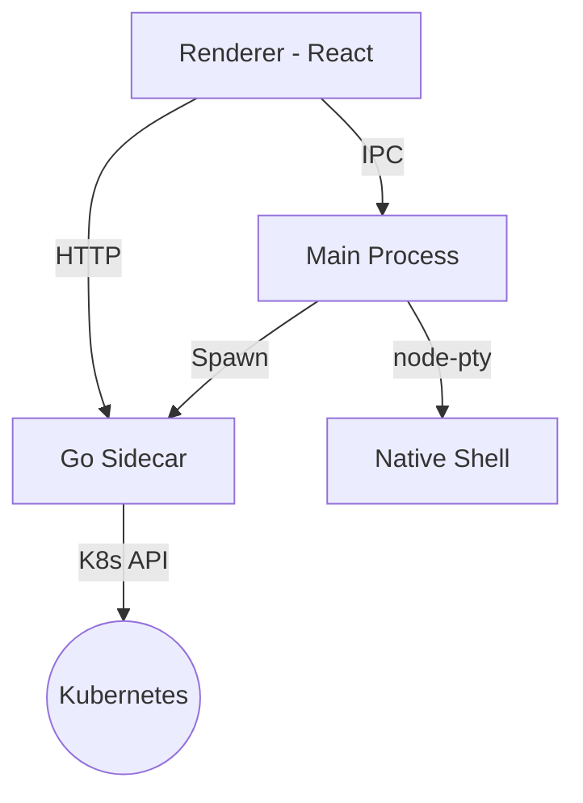

# 🏛️ Architecture Overview

Podscape is a three-process application designed for maximum performance and reliability when interacting with Kubernetes clusters.

## 1. Process Layout

### Renderer (React + TypeScript)
- The UI layer, built with Vite and React.
- Manages local state using **Zustand**.
- Communicates with the Go Sidecar via standard HTTP fetches for data.
- Communicates with the Main process via Electron IPC for native features.

### Go Sidecar (`podscape-core`)
- A standalone binary written in Go.
- **Source of Truth**: Handles all Kubernetes API interactions and Helm logic.
- **In-memory Cache**: Uses K8s Shared Informers to provide instantaneous resource lists.
- **Performance**: Capable of processing thousands of resources without blocking the UI.

### Main Process (Electron/Node.js)
- Manages the application lifecycle (window management, menu, tray).
- **Sidecar Manager**: Starts, monitors, and stops the Go subprocess.
- **Native Bridge**: Handles PTY terminal sessions, file system dialogs, and native log streaming.

## 2. Data Flow

## 3. High Availability & Reliability
- **Sidecar Health Checks**: The Main process polls the sidecar's `/health` endpoint before revealing the UI.
- **Retry Logic**: API calls from the Renderer include exponential backoff and retries to handle sidecar startup latency.
- **Automated Lifecycle**: The sidecar is automatically terminated when the Electron app closes to prevent orphaned processes.
