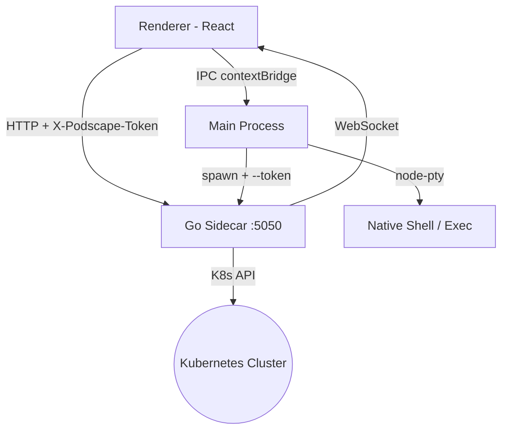

# Architecture Overview

Podscape is a three-process Electron application. Each process has a strictly defined responsibility.

## Process Layout

```
Renderer (React / TypeScript)
  ├── HTTP fetch ──────────────────► Go Sidecar (127.0.0.1:5050)
  │                                   All Kubernetes + Helm operations
  └── IPC via contextBridge ────────► Main Process (Node.js)
                                        Terminal, settings, file dialogs,
                                        log streaming, port-forward, sidecar lifecycle
```

### Renderer (`src/renderer/`)

- Built with **Vite + React + TypeScript + Tailwind CSS**.
- State managed by a single **Zustand** store (`useAppStore`) split into slices: cluster, navigation, resource, operation.
- Talks to the sidecar via plain `fetch()` through IPC helpers (`checkedSidecarFetch` in `src/main/api.ts`).
- All 27+ resource type arrays, context/namespace selection, section navigation, exec modal state, and port-forward state live in the store.

### Go Sidecar (`go-core/`)

The sidecar is a standalone HTTP server compiled as `podscape-core`. It is the source of truth for all Kubernetes and Helm data.

| Package | Responsibility |
|---|---|
| `cmd/podscape-core/main.go` | Route registration, startup, token auth middleware, CORS |
| `internal/handlers/handlers.go` | One handler per resource type and operation |
| `internal/informers/` | K8s shared informers — cache resource lists in-memory for fast reads |
| `internal/store/` | `ClusterStore` singleton: per-context `ContextCache` pool, active context pointer |
| `internal/portforward/` | Manages active tunnels, streams events over WebSocket |
| `internal/exec/` | WebSocket-based container exec (PTY) |
| `internal/logs/` | WebSocket-based log streaming |
| `internal/ownerchain/` | Upward + downward owner reference traversal with 30s reverse-index TTL |
| `internal/prometheus/` | Prometheus auto-discovery via k8s service proxy, batch query with 30s result cache |
| `internal/helm/` | `HelmRepoManager` — repo list, chart search, version fetch, values, SSE install |

**Context cache pool**: each Kubernetes context gets its own `ContextCache` (clientset, informers, resource maps). Switching context restarts informers for the new context without affecting others already cached.

**No-kubeconfig mode**: if no valid kubeconfig is found at startup, the sidecar still starts the HTTP server and sets `NoKubeconfig = true`. `/health` returns 200 immediately so the renderer can show the `KubeConfigOnboarding` screen instead of an error dialog. After the user sets a kubeconfig path, the sidecar is restarted via `window.sidecar.restart()` IPC.

**Token auth**: the sidecar is launched with a randomly generated `--token` flag. Every request (except `/health`) must include the `X-Podscape-Token` header matching that token. The token is passed to the renderer via IPC and injected by `checkedSidecarFetch`.

### Main Process (`src/main/`)

| File | Responsibility |
|---|---|
| `index.ts` | App bootstrap, splash window, sidecar start, `BrowserWindow` creation |
| `sidecar.ts` | Launch / monitor / kill the Go subprocess; expose `sidecar:restart` IPC |
| `kubectl.ts` | IPC handlers for log streaming, port-forward, file copy, owner chain, metrics |
| `terminal.ts` | PTY terminal sessions via `node-pty` |
| `helm.ts` | Helm IPC handlers — repo browser, SSE install relay |
| `settings_storage.ts` | Read / write `~/.podscape/settings.json` |
| `api.ts` | `checkedSidecarFetch` — injects token, retries up to 20× with 500 ms delay |

### Preload (`src/preload/index.ts`)

Exposes six namespaced APIs to the renderer via `contextBridge`:

| Namespace | Purpose |
|---|---|
| `window.kubectl` | All k8s operations, port-forward, log streaming, file copy, owner chain, prometheus |
| `window.helm` | Helm release operations and repo browser |
| `window.exec` | PTY exec-into-container sessions |
| `window.settings` | Read / write app settings |
| `window.kubeconfig` | Kubeconfig file path selection |
| `window.sidecar` | Sidecar restart (used by kubeconfig onboarding) |

## Startup Sequence

```
1. app.whenReady()
2. createSplashWindow()          ← frameless Kubernetes-animated splash
3. startSidecar()                ← spawns podscape-core, polls /health every 500ms
   ├─ if kubeconfig missing:
   │   sidecar enters no-kubeconfig mode → /health returns 200 immediately
   └─ if kubeconfig found:
       sidecar loads informers → /health returns 200 once cache synced
4. createWindow(onReady)
   └─ ready-to-show → splash.destroy(), main window shown
```

## Data Flow



## Key Constants

All renderer-to-sidecar fetch calls use constants from `src/common/constants.ts`:

```typescript
SIDECAR_HOST    = '127.0.0.1'
SIDECAR_PORT    = 5050
SIDECAR_BASE_URL = 'http://127.0.0.1:5050'
SIDECAR_WS_URL   = 'ws://127.0.0.1:5050'
```
